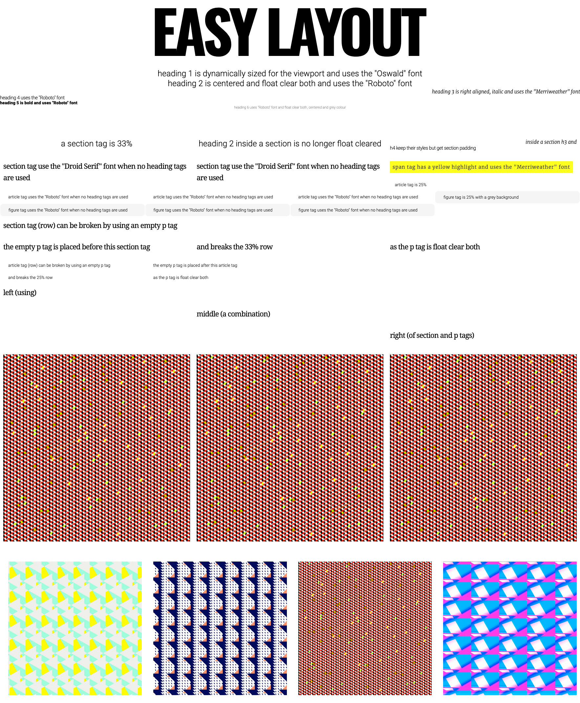

# Easy Layout

## Preformatted HTML tags using CSS styles

### An ultra simple boilerplate using standard HTML5 tags as 'widgets' to quickly and cleanly build mockups, wireframes, prototypes or page layouts without the need for css classes.

#### Disclaimer: This project is a work in progress. Test before deploying.

[LIVE SITE INSTRUCTIONS](https://easycss.github.io/easylayout/)

[LIVE SITE EXAMPLE PAGE](https://easycss.github.io/easylayout/example.html)

### TODO
  - add container / max width
